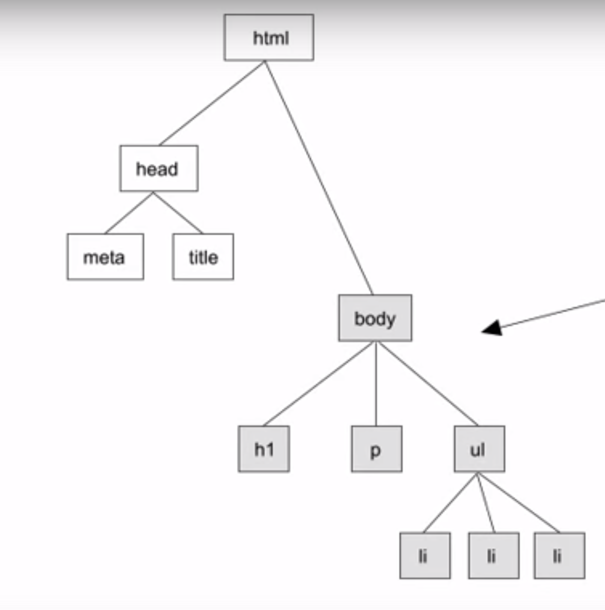

# Introduction to the DOM (Document Object Model)


## What is it?

The DOM is an interface for HTML, and XML (if people still use XML) documents that allows a developer to programmatically access and manipulate the contents of said document.  This allows us to change the document's style, structure, and content.  The DOM is represented as a hierarchy of interconnected nodes and objects that have specific methods to access their contents.  Let's look at an example:


```html

<!DOCTYPE html>
<html>
<head>
	<title></title>
</head>
<body>
	<h1>The DOM - I'm a child of body!</h1>
	<p>I'm also a child of body!</p>
	<ul>
		<li>I'm a list item, child of ul, and grandchild </li>
		<li>I'm another list item</li>
		<li>And one more</li>
	</ul>
</body>
</html>

```
Which would look like this in the DOM:




## Accessing it

Accessing elements of the DOM can be done using [W3C DOM](http://www.w3.org/DOM/), which is the standard that forms the basis of the DOM implemented in most modern browsers. For example:

```javascript

var lis = document.getElementsByTagName('li');
//lis[0] represents the first li found on the webpage.

```
We can also create scripts to access and manipulate the DOM

```html

<html>
<head>
	<script>
		//run this function when the document is loaded
		window.onload = function(){
			//h1
			var heading = document.createElement("h1");
			var heading_text = document.createTextNode("The DOM - I'm a child of body!");
			heading.appendChild(heading_text);
			document.body.appendChild(heading);
			//p
			var paragraph = document.createElement("p");
			var paragraph_text = document.createTextNode('I\'m also a child of body!');
			paragraph.appendChild(paragraph_text);
			document.body.appendChild(paragraph);
			// //ul
			var list = document.createElement("ul");
			var li_node = document.createElement("li");
			var li_node_text = document.createTextNode("I'm a list item, child of ul, and grandchild");
			li_node.appendChild(li_node_text);
			list.appendChild(li_node);
			document.body.appendChild(list);
		}
	</script>
</head>
<body>
</body>
</html>


```


The above code is exactly the same at the HTML written before (minus 2 li items), but we're creating everything on page load.  The above javascript will run when the document is loaded, and when the whole DOM is available for use.


There are a ton of methods available to the DOM, and I only scratched the surface of them.  This will hopefully give a basic introduction to the DOM.  


